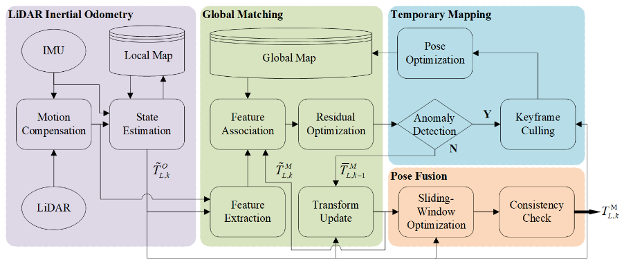
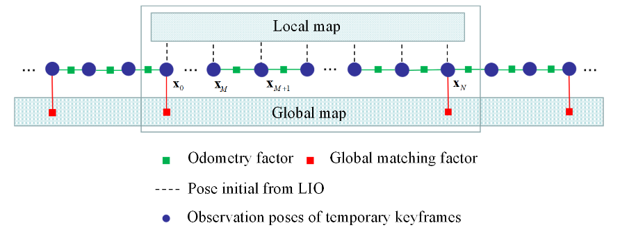
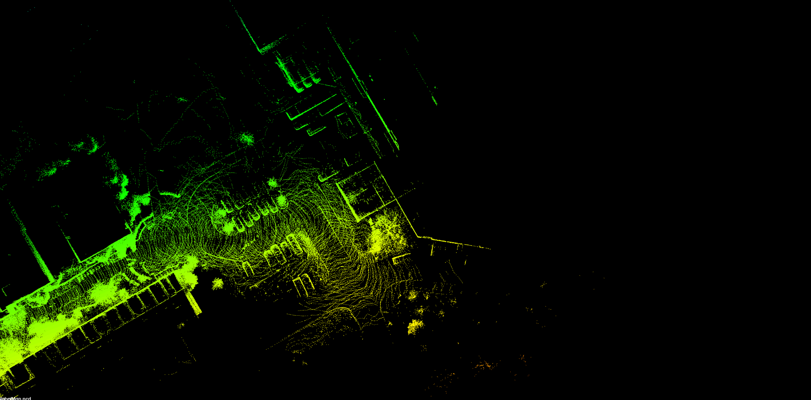
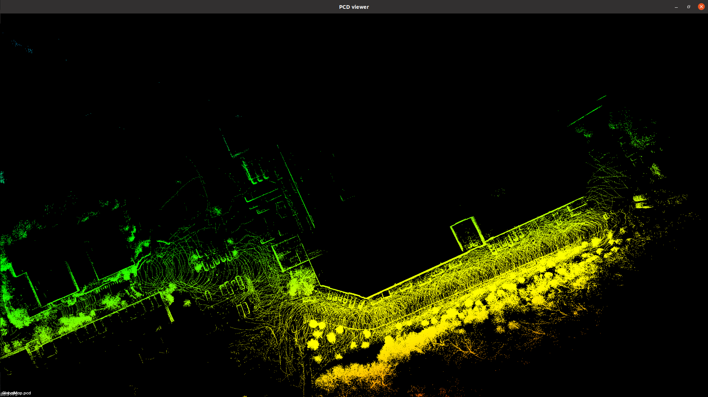
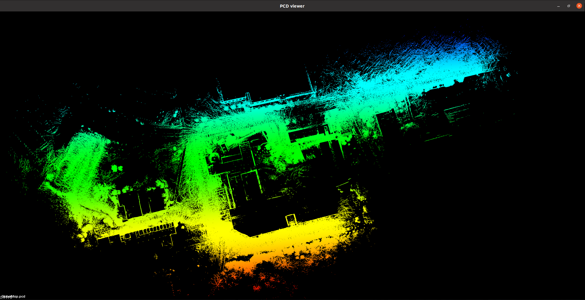
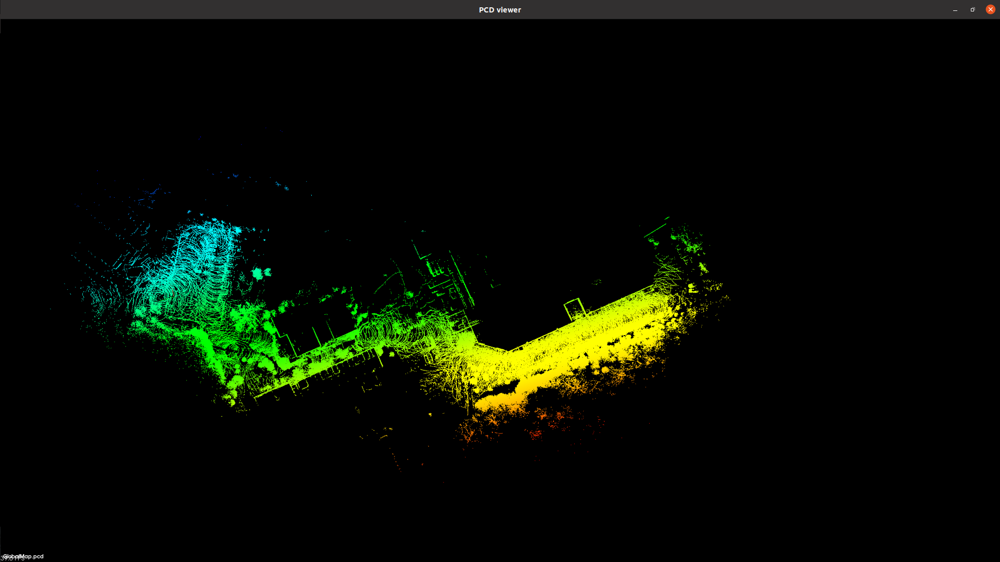

# ROLL

- [ROLL](#roll)
  - [效果展示](#效果展示)
  - [算法框架](#算法框架)
    - [fast-lio建图模块](#fast-lio建图模块)
    - [全局优化模块](#全局优化模块)
    - [临时建图模块](#临时建图模块)
    - [位姿优化模块](#位姿优化模块)
  - [主要参数](#主要参数)
  - [算法优化及测试](#算法优化及测试)
  - [使用说明](#使用说明)
    - [环境及文件配置](#环境及文件配置)
    - [启动定位](#启动定位)
  - [实验结果](#实验结果)

## 效果展示

   <div align="center">
   
   </div>

## 算法框架

ROLL为基于FAST-LIO2的一种建图+定位算法，同时，基于GTSAM的因子图优化，实现了当机器人运动至未知区域，内点得分（计算方式类似LOAM）低于阈值时，触发临时建图机制，当回环访问的内点得分高于一定阈值则将临时建图部分融合到全局地图，以更新全局地图。



### fast-lio建图模块

该模块可以使用任意的LIO方法，在论文中使用的是fast-lio2。输入激光雷达和IMU数据，该模块输出里程计位姿和经过运动补偿后的lidar点云数据。输出的点云数据提供给global matching做特征提取。

### 全局优化模块

基于LOAM框架，Global Map由一系列关键帧组成。当temporary mapping触发时，Global Map将被更新。

考虑到室内室外场景，提出了confined areas和open areas的概念，当近距离lidar点的数量超过一定比例，可认为是室内区域。室内区域的voxel filter size相对小一些。Residual Computation和Transform Update部分，与LOAM类似，优化角点到线及面点到面的残差。

### 临时建图模块

首先进行异常检测，这里定义了一个matching inlier ratio指标，意思是特征点匹配过程中，匹配距离（点线和点面距离）小于1m的数量占比。当比例小于一定阈值时，系统便进入到临时建图Temporary Mapping的模式，否则认为global matching是可靠的。

而当特征点匹配达到一定阈值，其fast-lio2的关键帧滑窗数量大于阈值时，执行地图融合。那如何将临时建的图融合到全局地图中呢？作者采用了位姿图优化的方法，如下图定义了Odometry Factor（二元边）和Global Matching Factors（一元边）。



### 位姿优化模块

该模块主要作用是输出优化后的里程计位姿，由滑窗优化和一致性检测两部分组成。

滑窗优化主要是融合一段时间内的里程计位姿和全局定位的位姿，通过构建一个极大似然估计问题，如下公式，代码中实际使用gtsam求解。


## 主要参数

[params_nclt_loc.yaml](./ROLL/config/params_nclt_loc.yaml)

```yaml
use_sim_time: false
roll:
  debugMode: false # 调试模式。输出信息更多
  localizationMode: true #定位模式，建图设置为false
  mapUpdateEnabled: true

  saveKeyframeMap: true #关键帧地图
  savePCD: true # pcd地图
  savePose: true # 保存关键帧位姿
  saveLog: true # 日志

  saveMapDirectory: /home/lzq/ROLL_ws/logs/fastlio_noEdge/map_pcd
  saveKeyframeMapDirectory: /home/lzq/ROLL_ws/logs/fastlio_noEdge/keyframes
  loadKeyframeMapDirectory: /home/lzq/ROLL_ws/logs/real/keyframes
  saveRawCloud: false

  # temporary mapping mode
  startTemporaryMappingInlierRatioThre: 0.3 # 内点得分低于该值进入临时建图以及优化
  exitTemporaryMappingInlierRatioThre: 0.5 # 内点得分高于该值退出，将LOAM优化得到结果应用到位姿
  slidingWindowSize: 30 # 临时建图关键帧的滑动窗口数

  globalMatchingRate: 5 # 地图定位频率

  alti0: 270.0
  lati: 42.293227
  longi0: -83.709657

  initialGuess: [0, 0, 0, 0, 0, 0] # 初始位姿

  # Visualization
  globalMapVisualizationSearchRadius: 50.0 # 全局地图可视化距离阈值
  globalMapVisualizationPoseDensity: 0.5 # 全局位姿的体素栅格大小
  globalMapVisualizationLeafSize: 0.5 # 全局地图可视化的体素栅格大小

  # Surrounding map
  surroundingkeyframeAddingDistThreshold: 1.0 # 临时建图的关键帧判断距离
  surroundingkeyframeAddingAngleThreshold: 0.2 # 代码没实际使用
  surroundingKeyframeDensity: 0.3 # 当前点云体素栅格大小
  surroundingKeyframeSearchRadius: 20 # 当前帧点云匹配关键帧的搜索半径
  # Topics
  pointCloudTopic: cloud_registered_body # 来自fast-lio2经过矫正的点云话题
  gpsTopic: fix1
  gtTopic: ground_truth

  # Frames
  lidarFrame: lidar_link
  mapFrame: odom

  # GPS Settings
  gpsCovThreshold: 2.0 # m^2, threshold for using GPS data
  poseCovThreshold: 1.0 # m^2, threshold for using GPS data

  # NCLT HDL-32:
  sensor: velodyne # lidar sensor type, either 'velodyne' or 'ouster'
  N_SCAN: 128 ## number of lidar channel (i.e., 16, 32, 64, 128)
  Horizon_SCAN: 1800 ## lidar horizontal resolution (Velodyne:1800, Ouster:512,1024,2048,robosense: 2000)
  downsampleRate: 1 # default: 1. Downsample your data if too many points. i.e., 16 = 64 / 4, 16 = 16 / 1

  lidarMinRange: 1 # default: 1.0, minimum lidar range to be used
  lidarMaxRange: 150.0 ## default: 1000.0, maximum lidar range to be used

  # LOAM feature threshold
  edgeThreshold: 0.1 # 角点判断阈值
  surfThreshold: 0.1 # 面点判断阈值
  edgeFeatureMinValidNum: 10
  surfFeatureMinValidNum: 100

  # voxel filter paprams
  odometrySurfLeafSize: 0.4 # default: 0.4 - outdoor, 0.2 - indoor
  mappingCornerLeafSize: 0.2 # default: 0.2 - outdoor, 0.1 - indoor
  mappingSurfLeafSize: 0.4 # default: 0.4 - outdoor, 0.2 - indoor

  # CPU Params
  numberOfCores: 4 # number of cores for mapping optimization

  # Loop closure
  loopClosureEnableFlag: false # 回环优化用在建图中，开启后建图效果并没有变好
  loopClosureFrequency: 1.0 # Hz, regulate loop closure constraint add frequency
  surroundingKeyframeSize: 50 # submap size (when loop closure enabled)
  historyKeyframeSearchRadius: 15.0 # meters, key frame that is within n meters from current pose will be considerd for loop closure
  historyKeyframeSearchTimeDiff: 30.0 # 30 by default,seconds, key frame that is n seconds older will be considered for loop closure
  historyKeyframeSearchNum: 25 # number of hostory key frames will be fused into a submap for loop closure
  # 0.3 by default, but for indoor it can go wrong, actually mostly for good matches, fitnessScore is around 0.03 ;
  #icp threshold, the smaller the better alignment
  historyKeyframeFitnessScore: 0.2
```

## 算法优化及测试

1. 修改代码实现在RVIZ中发布位姿，实现调整初始位姿  

   在[mapOptmization.cpp](./ROLL/src/mapOptmization.cpp)文件的void updateInitialGuess()函数中修改以下代码

   ```C++
   if(localizationMode && poseGuessFromRvizAvailable)
   {
      Eigen::Affine3f tWrong = trans2Affine3f(transformTobeMapped);
      Eigen::Affine3f tCorrect = relocCorrection*tWrong;
      pcl::getTranslationAndEulerAngles(tCorrect, transformTobeMapped[3], transformTobeMapped[4], transformTobeMapped[5], transformTobeMapped[0], transformTobeMapped[1], transformTobeMapped[2]);
      Eigen::Affine3f affine_body_to_map = tCorrect; // 将RIVZ发布的位姿信息更新到当前位姿关系
      affine_imu_to_map = affine_body_to_map*affine_imu_to_body;
      affine_odom_to_map = affine_imu_to_map*affine_imu_to_odom.inverse();
      for(int i = 0;i < 6;i++){
         rvizGuess[i] = transformTobeMapped[i];
         transformBeforeMapped[i] = transformTobeMapped[i];
      }
      printTrans("The reloc pose given by rviz: ",transformTobeMapped);
      poseGuessFromRvizAvailable = false;
      tryReloc = true;
      return;
   }
   ```

2. 对LTAOM的关键帧做角点和面点的提取，用于ROLL定位
   
   将ROLL中提取关键帧中的角点和面点的代码单独写成一个[corner_surface.cpp](./ROLL/src/corner_surface.cpp)，其中将livox雷达的数据转为256线的velodyne数据，用于在每条线上提取角点和面点。
   
   同时由于LTAOM输出关键帧为基于建图原点坐标系，而ROLL使用关键帧基于当前雷达坐标系，所以在其中加入了pose的逆矩阵转换，解决了ROLL加载关键帧错误的问题。

   视频：[室内楼梯场景定位](./vedio/loc_2.mp4)

3. 算法内存优化
   
   将原始算法在开始时一次性加载所有关键帧，改为在只加载当前位置附近的关键帧，随着位置的变动，加载不同的关键帧（每隔几米，加载半径内的关键帧），修改后代码为[mapOpt_LoadChange.cpp](./ROLL/src/mapOpt_LoadChange.cpp)

4. 减小算法CPU占用率

   在改完关键帧读取策略后，内存降下去了，但是CPU占用率上去了，相比于之前的约70%，现在变成了200%。

   经过多次比较实验，发现是关键帧密度问题，导致算法输入点云量太多，进而计算量增大。LTAOM采用等距采样子图，再以等数量子图采样获得关键帧，当前算法中阈值得到关键帧约每2m一帧，全局关键帧2155；但是经过ROLL采样过滤后，全局关键帧仅540，且体素栅格相比LTAOM更大，所以计算量相对更小，实测约50%。

## 使用说明

### 环境及文件配置

库文件存放于[百度网盘](https://pan.baidu.com/s/1XJYSR27Ko-KI3SulEqjZGA?pwd=9ccc)中，由于LTAOM与ROLL使用的gtsam库不同，所以请**务必将库安装在工作空间下**，避免库调用冲突

1. Ubuntu 20.04

2. ROS noetic

3. ceres 1.14.0
    
    ```
    cd ceres-solver-1.14.0
    mkdir build
    cd build
    cmake -DCMAKE_INSTALL_PREFIX=~/ROLL_ws/devel ..
    sudo make install
    ```

4. gtsam 4.0.2

    ```
    cd gtsam-4.0.2
    mkdir build
    cd build
    cmake -DCMAKE_INSTALL_PREFIX=~/ROLL_ws/devel ..
    sudo make install
    ```

5. ROLL_ws目录下新建logs目录及子目录（具体可参照[yaml参数文件](./ROLL/config/params_nclt_loc.yaml)）

6. 编译工作空间
   
   新建工作空间：`mkdir -p ROLL_ws/src`

   将目录下ROLL和FAST_LIO文件夹复制到src目录下

   编译：`catkin_make`

    
### 启动定位

LTAOM建图完成且生成关键帧，修改`loadKeyframeMapDirectory`路径为LTAOM生成文件夹。

```
souce ~/ROLL_ws/devel/setup.bash
roslaunch roll loc_nclt.launch 
```

## 实验结果


1. nclt公开数据集及bag包数据测试
   
   当机器人访问到地图中没有的地方（以LOAM中的内点比率做阈值判断标准），ROLL可以实现构建临时地图，但是需要当临时地图和已有全局地图的内点比率大于一定阈值（类似回环），才会将临时地图融合进全局地图（此部分包含GTSAM的因子图优化）。
   
   下图是原始用于定位的关键帧地图的结束位置

   

   下图是ROLL访问到新的地图构建出的地图，可见定位地图中后续缺少的地方，经过ROLL建图添加到了地图中。

   

   下图是当前数据包全局地图

   

   下图是ROLL重新构建的全局地图，可见最上方的地图并没有构建出来，这正是由于没有和定位地图发生临时地图融合（LOAM计算的内点得分未达到阈值）导致的。

   

   视频：[nclt数据的重定位+地图更新](./vedio/roll_1.mp4)
   
   <font color=OrangeRed>ps：</font>会考虑一个情况是，第一次构建临时地图融合到全局地图后，那第二次触发构建临时地图，这次匹配是否会将第一次的临时地图考虑进去。由于当前数据不满足该情况，无法验证。

2. 大型数据集测试
   
   使用LTAOM对nclt数据集（2012-02-02，包含约1.5h，5.5km的数据）建图并提取关键帧中的角点和面点，再使用nclt(2013-01-10)实现定位及临时建图融合。实验结果表明，在nclt(2013-01-10)数据的机器人运动轨迹不完全重和，且部分雷达数据不相同的情况下，依然可以实现定位和临时建图。但是定位过程中，机器人姿态会出现轻微抖动，怀疑是定位模式下的位姿优化导致。

   视频：[大型数据集下的建图与定位](./vedio/nclt不同数据集的建图与定位.mp4)

3. 实际定位效果

   在实际场景中，使用LTAOM建图得到的关键帧地图进行定位，视频如下：

   [ROLL定位_真实场景.mp4](./vedio/ROLL定位_真实场景.mp4)
